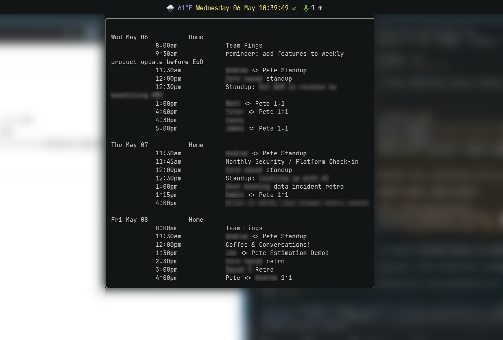

# waybar-gcalcli-agenda



A small, opinionated setup for displaying your Google Calendar agenda on Linux:

- **Waybar tooltip** — hover the clock to see the next several days of meetings.
- **`agenda` script** — a self-refreshing terminal view you can leave open in a
  tmux pane / floating window, or launch from the Waybar clock with a click.

Both views are driven by [`gcalcli`](https://github.com/insanum/gcalcli), which
talks to the Google Calendar API directly. This avoids a class of rendering
bugs that plague iCal-based TUIs (notably, duplicated recurring events caused
by RRULE + RECURRENCE-ID overrides — the same data Google emits in CalDAV).

## What's in here

```
scripts/clock-agenda.sh        # Waybar custom/clock module: time + agenda tooltip
bin/agenda                     # Live-refreshing terminal agenda view
examples/gcalcli-config.toml   # Drop-in gcalcli defaults
examples/waybar-clock-module.jsonc  # Waybar module snippet
```

## Prerequisites

- Linux with Waybar (Wayland; Hyprland, Sway, etc.)
- `gcalcli` 4.x — Arch: `yay -S gcalcli`; pip: `pipx install gcalcli`
- `jq`, `bash`, `coreutils` (almost certainly already installed)
- A terminal emulator you like; the example assumes `foot` but anything works

## 1. Set up Google Cloud OAuth credentials

`gcalcli` 4.x no longer ships with a shared OAuth client — you create your own
in Google Cloud. This is free, takes ~5 minutes, and the credentials never
leave your machine.

1. Go to <https://console.cloud.google.com/> and create (or select) a project.
   Name it whatever you want, e.g. `personal-cli-tools`.
2. Enable the **Google Calendar API**:
   APIs & Services → Library → search "Google Calendar API" → Enable.
3. Configure the OAuth consent screen:
   APIs & Services → OAuth consent screen.
   - User type: **External** (unless you're on Google Workspace and want
     Internal — both work).
   - App name: anything (e.g. `gcalcli`).
   - User support email + developer contact: your own email.
   - Scopes: you can leave the default; gcalcli will request what it needs.
   - Test users: **add your own Google account email**. Without this, the
     OAuth flow will refuse to issue tokens because the app is in "testing"
     status.
4. Create the OAuth client:
   APIs & Services → Credentials → Create Credentials → OAuth client ID.
   - Application type: **Desktop app**.
   - Name: anything (e.g. `gcalcli-desktop`).
   - Click Create. Copy the **Client ID** and **Client Secret** that appear.

You won't need to publish the app or go through Google's verification — the
"testing" status is fine for personal use, it just means you have to add
yourself as a test user (step 3).

## 2. First-run authentication

Tell gcalcli about your client ID, then run any command — it'll open a browser
to complete the OAuth handshake and cache a refresh token locally.

```bash
mkdir -p ~/.config/gcalcli
cp examples/gcalcli-config.toml ~/.config/gcalcli/config.toml
# edit ~/.config/gcalcli/config.toml: replace you@example.com with your address

gcalcli --client-id "YOUR_CLIENT_ID" --client-secret "YOUR_CLIENT_SECRET" list
```

A browser window opens; approve access; back in the terminal you'll see your
calendar list. The token is saved to `~/.local/share/gcalcli/` (or similar
platformdirs location) and you don't need to pass `--client-id` again.

You can also put `client-id` in `~/.config/gcalcli/config.toml` under
`[auth]`. The secret has to stay on the command line for the very first
authentication; after that the cached token takes over.

Verify it works:

```bash
gcalcli agenda
```

## 3. Install the `agenda` script

```bash
install -Dm755 bin/agenda ~/.local/bin/agenda
```

Make sure `~/.local/bin` is in your `PATH`. Then:

```bash
agenda           # default 60s refresh
agenda 30        # 30s refresh
agenda 60 -- calw   # weekly grid view; pass any gcalcli subcommand after --
```

Press `q` (or Ctrl-C) to quit.

## 4. Hook it into Waybar

Install the tooltip script:

```bash
install -Dm755 scripts/clock-agenda.sh ~/.config/waybar/scripts/clock-agenda.sh
```

Edit `~/.config/waybar/config.jsonc`:

1. Replace `"clock"` with `"custom/clock"` in your `modules-center` (or
   wherever you list it).
2. Replace your `"clock": { ... }` block with the one in
   `examples/waybar-clock-module.jsonc`. Adjust the click handlers to use
   your terminal of choice.

If you have CSS rules targeting `#clock`, mirror them onto `#custom-clock`:

```css
#clock,
#custom-clock {
  /* your existing styles */
}
```

Reload Waybar:

```bash
pkill -SIGUSR2 waybar
```

Hover the clock — you should see today's agenda followed by the next few
days. The tooltip is cached for 5 minutes, so the script can run every second
without spamming the Calendar API.

## Trade-offs vs. the default Waybar clock

Switching to `custom/clock` loses two built-in clock features:

- The **month-grid calendar tooltip** (the `{calendar}` placeholder).
- **`format-alt`** — right-click toggle between two date formats.

Both can be reinstated by keeping the original `clock` module and adding a
separate `custom/agenda` module elsewhere on the bar (with its own icon and
tooltip). PRs welcome if you build that variant.

## Why not calcure / khal / iCal-based TUIs?

CalDAV exports recurring events as a master VEVENT with an `RRULE`, plus one
extra VEVENT per modified instance carrying a `RECURRENCE-ID`. RFC 5545 says
the override should *replace* the RRULE-generated occurrence for that date.
Several popular TUIs (calcure in particular) render both — so today's recurring
meeting shows up once at the right time and again as an untimed entry.

Going through `gcalcli` sidesteps this because the Google Calendar API hands
you already-resolved event instances.

## License

MIT — see [LICENSE](LICENSE).
